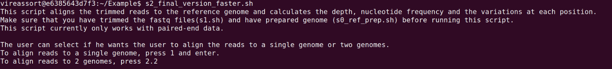

# ViReassort


## About

ViReassort is a bioinformatic pipeline which allows the user to analyze sequencing data derived from reassortant viral strains. The pipeline was initially designed to align reads from reassortant Influenza A virus (IAV) population and align it to the parental IAV strains. Albeit, in principle, it can also be used to analyse data from  any reassortant segmented virus. The pipeline provides a pre-installed collection of software tools inside a [Docker](https://www.docker.com/) container which can be run locally on any machine. The docker container also contain scripts which automate various steps in the pipeline, the overview of which is provided below.


ViReassort aligns the raw FASTQ files of the reassortant virus to the two reference genomes of the parental strains. The alignment scores for each individual read in the mapped sample are compared for both the reference genomes. For this comparison, ViReassort assumes that each individual read must have better alignment quality to the reference genome segment it belongs to. Only those reads are retained in the mapped SAM file, which have a greater alignment score for that particular reference genome as compared to the other. In case that the read has the same alignment score for both the references, the mapped read will be retained in both the reference alignment SAM files. For each sample processed, ViReassort provides separate information about genome coverage and mapping depth, major and minor variants and consesus genomes produced for both the genome alignments. 

At this stage the pipeline is only able to handle Illumina paired-end reads but will be updated to include single-end reads in the future.

## Software

Here is the list of softwares installed within the Docker container. 

- [bcftools v1.9](https://github.com/samtools/bcftools)
- [Bowtie2 v2.5.0](http://bowtie-bio.sourceforge.net/bowtie2/)
- [htslib v1.12](https://github.com/samtools/htslib)
- [Lofreq v2.1.2](http://csb5.github.io/lofreq/)
- [picard v2.11](https://broadinstitute.github.io/picard/)
- [pysamstats v1.1.2](https://github.com/alimanfoo/pysamstats)
- [Samtools v1.16.1](http://samtools.sourceforge.net/)
- [Trimmomatic v0.36](http://www.usadellab.org/cms/?page=trimmomatic)

## Using Docker

To run the pipeline on your own machine, you will first need to install the [**Docker**](https://docs.docker.com/get-docker/) platform. Once the setup is complete, you can run the following command in a terminal to load the container


```
docker run --rm -it vireassort:latest
```

The following command allows you to enter the ViReassort docker container and you should be able to access and run any of the installed softwares and/or custom scripts to process the data.


To exit the container just type ```exit``` on the terminal window. You will see the command prompt reverting back to the original user directory.
 


## Input requirements
To run ViReassort you require: 

1. Raw paired-end FASTQ files of reassortant virus.
2. Genome sequence of both the parental virus strains in FASTA format. 

## Example

Run the following command in a terminal to start the container.

```
docker run --rm -it vireassort:latest 
```

After running the command, you should be inside the ```/homes``` directory of the container. You should also be able to see the Example directory with sample reassortant virus FASTQ files and reference genomes of the parental strains.

```
ls
cd Example
ls
```


### Step 1: Trimming the FASTQ files of the reassortant virus.

For the first step, the raw FASTQ read files from the reassortant virus are filtered, trimmed and adapter sequence removed to obtain processeed reads ready to be aligned to both the parental reference genomes. We will use the ``s1.sh``` script to perform the trimming. 

```
s1.sh 
```


After running the above command, you will be prompted to provide the location (directory) of the raw FASTQ files. Please provide the same.


If the script is executed successfully, there should be directory called ```s1_trimmed``` in the current folder containing trimmed FASTQ files. 
**Note:** By default, the script will process all the FASTQ files present in the directory location which is provided by the user. In such cases where there are FASTQ files belonging to multiple samples, all the samples will be processed and the trimmed files will be present in the respective sample folders inside ```s1_trimmed``` directory.

### Step 2: Preparing the reference genomes.

In this step, we prepare the reference genomes of both the parental strains for alignment using Bowtie2. To do this, execute the ```s0_ref_prep.sh``` script. 

```
s0_ref_prep.sh
```

You will be asked to provide the location (directory) of the FASTA files. Please provide the same.


If the script is executed successfully, then you should be able to see the ```completed``` directory which contains individual folders for both the reference genomes. 
**Note:** By default, the script will process all the FASTA genome files present in the directory location which is provided by the user. In our case, we have two parental genome FASTA files which should result in two folders inside the ```completed``` directory (one for each of the reference/parental genomes).


### Step 3: Alignment and downstream analysis.

This is the final step of the pipeline which involves alignment of the processed trimmed reads to both the reference genomes and comparisons of the alignment files to decipher from which parental strain did each individual read was derived from. This is then followed by calculation of read depth matrices, variant calling anf filtering, and consensus genome generation using major variants for both the genome alignments. All this can be executed using  the ```s2.sh``` script. The user also has an option to run the script individually for both the genomes. In this case (Option 1) the comparison between the aligned reads does not take place.


```
s2_final_version_faster.sh
```

Users will be prompted to select the mode in which they want to run the script. For default behaviour please type 2 and press ```Enter```.



Users will then be asked to enter the location of both the prepared genome files, followed by the location of the processed FASTQ folder and finally the directory where the output shall be saved. If the script is executed successfully, then you will be able to see the results in the specified location within the directory named ```s2_alignment_hybrid```.


## Output files:

For each sample, the following files with respective prefixes will be generated for both the parental genomes. 


For the example results, the alignment to the pdm_reference genome will produce the following files:

1. reassortant_virus_R1_001_pdm_reference.bam - Initial alignnment file (BAM format) 
2. reassortant_virus_R1_001_pdm_reference.sam  - Initial alignnment file (SAM format)
3. reassortant_virus_R1_001_pdm_reference_filtered.sam - Alignment file after removing reads which align better to the other reference genome (SAM format)
4. reassortant_virus_R1_001_pdm_reference_sorted.bam - Sorted alignment file after removing reads which align better to the other reference genome (BAM format)
5. reassortant_virus_R1_001_pdm_reference_coverage_gc - Read coverage for each mapped location of the reference genome 
6. reassortant_virus_R1_001_pdm_reference_coverage_strand_depth - Detailed read coverage information for each mapped location of the reference genome
7. reassortant_virus_R1_001_pdm_reference_nucl_freq - Nucleotide frequency across each mapped location of the reference genome
8. reassortant_virus_R1_001_pdm_reference_variants.vcf - All variants detected
9. reassortant_virus_R1_001_pdm_reference_variants_major.vcf - Variants with allele frequency > 0.5
10. reassortant_virus_R1_001_pdm_reference_variants_minor.vcf - Variants with allele frequency ≤ 0.5
11. reassortant_virus_R1_001_pdm_reference_major_consensus.fa - Consensus genome generated by incorporating the major variants into the reference genome.


## Processing your own data

In order to process your data, you should mount the folder containing the raw FASTQ files of reassortant virus and the parental genome FASTA files onto the docker container. For example, in case your data is present in the directory ```/home/user/data/``` , then run the following command to mount the folder onto the ViReassort container:

```
docker run --rm -it -v /home/user/data/:/homes vireassort:latest
```

Once you have done so, you can run and execute the commands as shown above for the example files to obtain the final results.


## Citation
Please cite the link to this repository if you use the pipeline.
